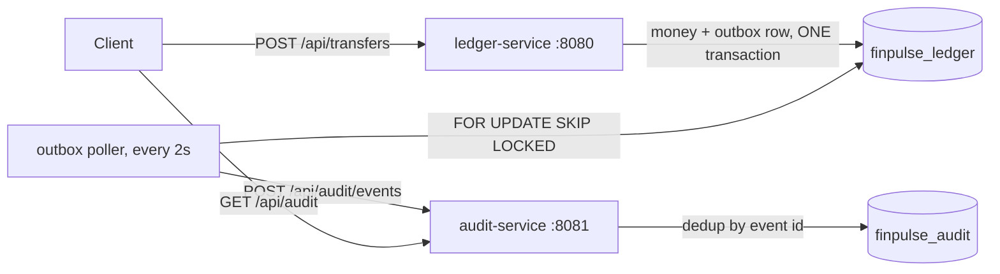

# FinPulse Ledger

A double entry wallet ledger built as two independent Spring Boot services over PostgreSQL.
`ledger-service` owns accounts, transfers, and the double entry invariant. `audit-service`
holds an independent, immutable, deduplicated record of every posted transfer, fed
asynchronously through a transactional outbox, with no distributed transaction between them.

Every number in this README was measured on a running system, not estimated.

## Architecture



The two services never share a database and never call each other during a transfer.

## Run it

```bash
docker compose up --build
```

Three containers start in dependency order, each gated on the previous being *healthy*
rather than merely started. Both databases are created automatically. Ready in about 20
seconds.

| Service | Port |
|---|---|
| ledger-service | 8080 |
| audit-service | 8081 |
| PostgreSQL | 5432 |

## API

| Method | Path | Notes |
|---|---|---|
| POST | `/api/accounts` | create an account |
| GET | `/api/accounts/{id}` | balance and metadata |
| POST | `/api/transfers` | requires an `Idempotency-Key` header |
| GET | `/api/accounts/{id}/entries` | paginated statement |
| GET | `/api/transactions/{id}` | a transaction with its entries |
| GET | `/api/audit?accountId=...` | audit-service, paginated |

```bash
# create two accounts
curl -X POST localhost:8080/api/accounts -H 'Content-Type: application/json' \
  -d '{"ownerName":"Asha","currency":"INR","openingBalanceMinor":10000}'

# transfer, idempotently
curl -X POST localhost:8080/api/transfers \
  -H 'Content-Type: application/json' \
  -H 'Idempotency-Key: transfer-001' \
  -d '{"fromAccountId":"<from>","toAccountId":"<to>","amountMinor":1500}'
```

Sending that transfer twice with the same key returns `201` then `200`, with the same
transaction id, and the money moves exactly once.

## Design decisions

### Money is a `long` in minor units

Binary floating point cannot represent most decimal fractions exactly, and the error
compounds across repeated arithmetic. In a ledger that means money invented or destroyed.
`long` paise is a primitive with no allocation and none of `BigDecimal`'s
`equals`-versus-`compareTo` scale trap. `BigDecimal` becomes correct the moment fractional
intermediate values appear, such as FX conversion or daily interest accrual.

### The double entry invariant holds by construction

Both entries are built from the same `amountMinor` variable inside one `@Transactional`
method, so there is no code path that can produce mismatched amounts. A failure at any
point rolls back all five writes together.

Verified by inducing a failure: an insufficient-funds transfer returned 422 and left row
counts unchanged, with zero rows carrying the failed idempotency key.

```sql
-- the invariant, as SQL. Must always return 0.
SELECT transaction_id,
       SUM(CASE WHEN direction='CREDIT' THEN amount_minor ELSE -amount_minor END) AS net
  FROM ledger_entry GROUP BY transaction_id;
```

### Idempotency is enforced by a unique constraint, not by a lookup

The `findByIdempotencyKey` check handles the ordinary case, but check-then-insert is not
atomic: two concurrent retries can both pass it before either commits. The unique
constraint on `idempotency_key` is what actually guarantees it, because the database
arbitrates rather than application timing.

### Optimistic locking with deadline-bounded retry

`@Version` on `Account` makes Hibernate append `AND version = ?` to every update, so a
stale writer matches zero rows and fails loudly instead of silently overwriting.

**Measured, 100 concurrent transfers out of one account:**

| | Result |
|---|---|
| No retry | 10–12 succeeded, balance wrong, non-deterministic across runs |
| 5-attempt cap | 51 of 100 succeeded |
| Deadline-bounded | **100 of 100, balance exactly 0, five consecutive runs** |

A fixed attempt cap cannot work here. With N threads on one row each attempt has roughly a
1/N chance, so a 5-attempt cap predicts a 77% failure rate, and even 20 attempts predicts
36%. The cap bounds the wrong quantity. A deadline lets a thread keep trying while the
system is still making progress.

The `version` column reaching exactly 100 is the proof: one increment per successful
update means none were lost.

### Pessimistic locking, implemented and measured

`transferPessimistic` uses `SELECT ... FOR UPDATE`, acquiring both rows in ascending UUID
order so the A-then-B versus B-then-A deadlock cannot form.

**Same workload, both strategies:**

| | Optimistic | Pessimistic |
|---|---|---|
| Succeeded | 100/100 | 100/100 |
| Wall clock | 3661 ms | **1258 ms** |

Pessimistic is roughly 3× faster under this contention, which is exactly what theory
predicts when every transaction wants the same row: queueing beats racing. Optimistic
remains the default because real per-account contention in a wallet is near zero, and a
contention sweep showed a fixed-attempt retry stops converging at about 4 concurrent
threads per row. The pessimistic path is the documented answer for a structurally hot row
such as a shared merchant settlement account.

### Lazy everywhere, `JOIN FETCH` at the one query that needs it

Every `@ManyToOne` is `LAZY`, overriding JPA's `EAGER` default, so no association is paid
for unless a specific query needs it.

**Measured on a page of 50 entries, cold:**

| | Queries | Time |
|---|---|---|
| Lazy | 53 | 540 ms |
| `JOIN FETCH` | **2** | 338 ms |

Payloads are byte-identical, so this is purely a performance change.

It is 53 rather than the commonly quoted 101 because all 50 entries belong to the same
account: after the first load Hibernate serves the rest from the persistence context, so
only the 50 distinct transactions cost a query each.

An explicit `countQuery` is required, since `JOIN FETCH` is not valid inside `COUNT`.
Pagination over `JOIN FETCH` is safe here only because both targets are `@ManyToOne`; over
a `@OneToMany` the join would multiply rows and `LIMIT` could slice through one parent's
collection.

### A composite index, with the plan change as evidence

`(account_id, created_at)` in that order. A B-tree is sorted by its first column then its
second, so this serves a filter on `account_id` and an ordering by `created_at` from one
index walk.

**`EXPLAIN (ANALYZE, BUFFERS)` on 22,204 rows:**

| | Before | After |
|---|---|---|
| Plan | Seq Scan + Sort | Index Scan Backward |
| Rows discarded | 21,654 | 0 |
| Buffers | 525 | **12** |
| Time | 2.127 ms | **0.051 ms** |

The Sort node disappearing is the point: the index already provides the required order.
Buffers falling from 525 to 12 is the honest measure of work avoided, since it does not
depend on cache warmth.

### Transactional outbox instead of a direct call

Calling audit-service from inside the transfer would be a dual write: a database commit and
a network call with no way to make them atomic. If the call succeeds and the commit fails,
audit holds a phantom record. If the commit succeeds and the call fails, a real transfer is
missing from the audit trail.

Two-phase commit would solve it in theory but requires every participant to implement the
protocol, holds locks across network round trips, and leaves participants blocked if the
coordinator dies mid-protocol.

The outbox avoids needing distributed atomicity at all: the event row is written by the
same repository, in the same transaction, as the money. The database's existing guarantee
covers it for free.

**The outage demonstration, run in Docker:**

```
docker compose stop audit-service
  -> 3 transfers posted, all 201
  -> finpulse.outbox.backlog = 3
  -> ledger balance exactly correct
docker compose start audit-service
  -> backlog drains to 0 with no intervention
  -> delivery lag recorded in the data: 1.8s normally, 33.1s for the three that waited
```

Delivery is at-least-once, deliberately. When a POST times out the sender cannot tell
whether the request or the response was lost, so it must choose between risking a duplicate
and risking a loss. For an audit trail, duplicates are recoverable and losses are not.
`audit-service` deduplicates on `eventId`, backed by a unique constraint, and absorbs
replays: the same event sent three times returned 202 each time with the record count
unchanged.

`FOR UPDATE SKIP LOCKED` makes the outbox table a safe work queue across multiple
`ledger-service` instances, with no leader election and no coordination service.

## Observability

**Correlation IDs.** A servlet filter puts one id into the SLF4J MDC per request, honouring
an incoming `X-Correlation-Id` so the id survives across services. The outbox poller sends
the transaction id as the correlation id, so one grep spans both services:

```
ledger-service | ... [demo-trace-1789929385] ... binding parameter <- [docker-1]
audit-service  | ... [18222b40-6efd-48b2-83f6-577ed3e39b24] ... Duplicate audit event ignored
```

The filter clears the MDC in a `finally` block. That is mandatory, not defensive: MDC
storage is thread-local and Tomcat reuses worker threads, so without it one request's id
leaks into the next.

**Metrics** at `/actuator/metrics`:

| Metric | Why |
|---|---|
| `finpulse.transfers.posted` | counts real transfers; idempotent replays excluded |
| `finpulse.transfers.latency` | p50/p95/p99, timed across retries |
| `finpulse.outbox.backlog` | **the one to alert on** |

The backlog gauge matters because the outbox never drops events, so a failing consumer's
only symptom is this number climbing while every other metric looks healthy.

**Runtime log levels.** `POST /actuator/loggers/com.finpulse.audit` with
`{"configuredLevel":"DEBUG"}` changes verbosity with no restart, which matters where a
restart needs a change-control ticket or would lose the state you are chasing.

## Stack

| Component | Version |
|---|---|
| Java | 21 |
| Spring Boot | 3.3.4 |
| PostgreSQL | 16 |
| Build | Maven |
| Containers | Docker Compose v2 |

Images are multi-stage: dependencies resolve before source is copied so a code change
reuses the cached layer, the runtime stage is JRE-only, and the process runs as a non-root
user.

## Known limitations

- **The outbox table grows without bound.** Published rows should be archived on a
  schedule. The poller's query only touches unpublished rows, so this degrades storage
  before it degrades throughput.
- **`ddl-auto=update` creates the schema.** Right for a build where the model is still
  moving, wrong for production, where this becomes Flyway so changes are versioned and
  reviewable.
- **TRACE-level SQL logging is on.** Deliberate, so query counts are observable, but it is
  expensive and writes parameter values into logs. Not a production setting.
- **Credentials are in `docker-compose.yml`.** Fine locally; these belong in a secret store.
- **No authentication.** Every endpoint is open.

## What I would do next

- Replace the poller's REST delivery with Kafka, so consumers subscribe to a durable,
  replayable log rather than being pushed to individually. The outbox stays; the broker
  replaces the poller.
- Testcontainers for the concurrency suite, so CI runs against a disposable Postgres
  instead of requiring a local stack.
- Redis in front of `GET /api/accounts/{id}` with write-time invalidation, since that is
  likely the highest-volume read at scale.
- Per-account rate limiting on transfers, to bound damage before the locking layer is
  involved.
